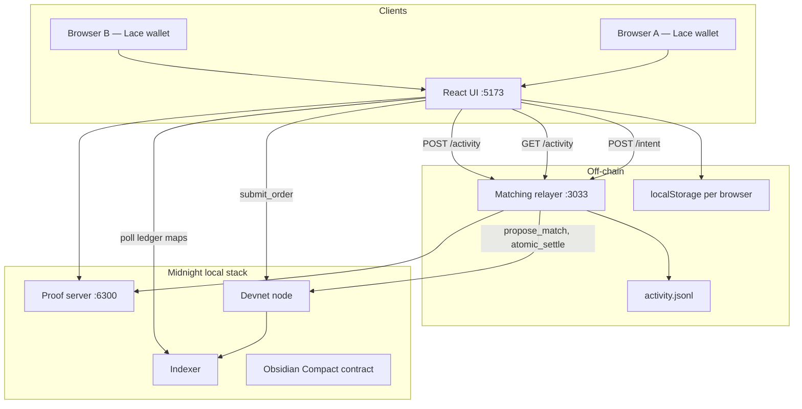
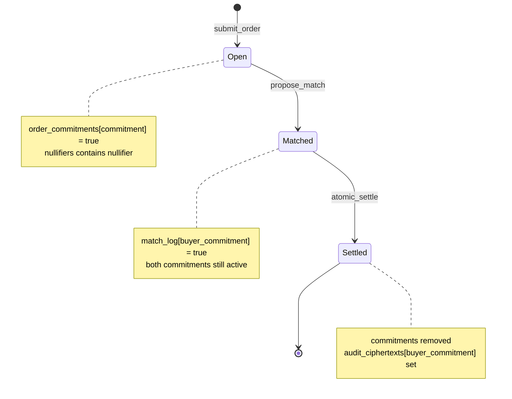
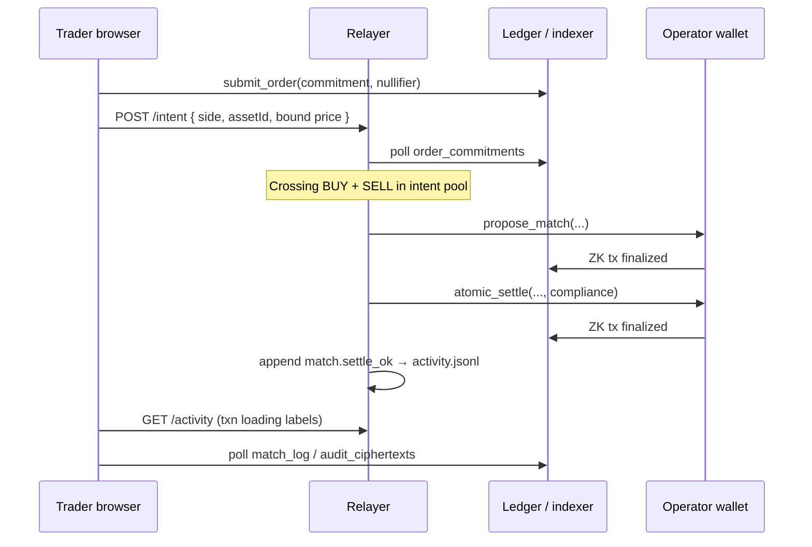
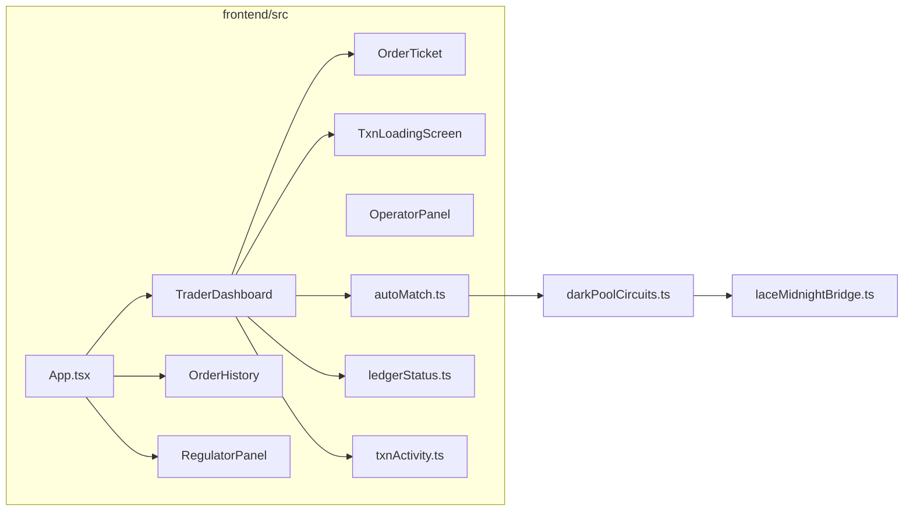

# Obsidian

Midnight Network dark-pool prototype: blind on-chain commitments, off-chain matching, ZK-validated crosses, and atomic settlement with optional audit payloads.

| Directory | Purpose |
|-----------|---------|
| [`frontend/`](frontend/) | React + Vite trader UI (Lace wallet, order ticket, activity-driven txn flow). |
| [`core/`](core/) | Compact contract, Vitest harness, Docker devnet, matching relayer, CLI demos. |
| [`backend/`](backend/) | Relayer architecture and multi-browser dev guide. |

---

## Technical architecture

### System context

Obsidian splits **privacy** (what traders publish on-chain) from **coordination** (who matches whom). Traders only disclose 32-byte commitments and nullifiers in `submit_order`. Cleartext asset, side, and price bounds live off-chain in the relayer intent pool and browser UI until a matchmaker runs `propose_match` with those values as circuit arguments.



### On-chain state machine

Three public circuits form the lifecycle. Ledger maps are the source of truth for whether an order is open, matched, or settled.



| Circuit | On-chain effect | Private / public inputs |
|---------|-----------------|-------------------------|
| `submit_order` | Inserts commitment + nullifier | Commitment, nullifier (disclosed) |
| `propose_match` | Writes `match_log` for buyer commitment | Buyer/seller commitments, max/min price, asset ids |
| `atomic_settle` | Removes commitments, stores audit blob | Buyer/seller commitments, compliance string |

Contract source: [`core/contracts/obsidian.compact`](core/contracts/obsidian.compact).

### End-to-end order flow (production path)



**Matching rules (off-chain):** same `assetId`, opposite side, `buyerMax >= sellerMin`, buy qty ≤ sell qty. Newest crossing peer wins when multiple sells/buys qualify.

### Frontend architecture



| Module | Responsibility |
|--------|----------------|
| `TraderDashboard.tsx` | Swap form, submit, auto-match, full-screen “order placed” + ticket |
| `TxnLoadingScreen.tsx` | Loading UX; labels from relayer activity (or demo carousel) |
| `txnActivity.ts` | Poll `GET /activity`, local event push, terminal detection |
| `orderMatcher.ts` | Crossing logic, queue diagnostics |
| `ledgerStatus.ts` | Indexer polls; SELL rows enriched via paired BUY |
| `registerRelayerIntent.ts` | `POST /intent`, activity fetch |
| `demoMode.ts` | `VITE_UI_DEMO` — timed carousel, SELL → SETTLED (UI-only, no relayer) |

### What is shared vs per-browser

| Layer | Shared? | Role |
|-------|---------|------|
| **On-chain ledger + indexer** | Yes | Authoritative lifecycle |
| **`obsidian/.obsidian/activity.jsonl`** | Yes | Append-only relayer + UI event log |
| **Relayer HTTP `:3033`** | Yes | Intent pool; activity API |
| **Browser `localStorage`** | No | Per-tab order table only |

See [`backend/README.md`](backend/README.md) for the two-browser flow (each browser: `submit_order` only; relayer: match + settle).

### Demo video mode

For screen recording without relayer/activity wiring:

```bash
yarn frontend:dev:demo   # VITE_UI_DEMO=true
```

- Real Lace `submit_order` → real `commitmentHex` / `nullifierHex` on the ticket
- Timed loading step carousel (not driven by `activity.jsonl`)
- SELL orders always render **SETTLED** on the receipt stub
- No relayer registration, activity watcher, or auto-match loop in demo

Production UI: `yarn frontend:dev` (full relayer + activity + matching).

---

## Prerequisites

- Node.js 22+
- Yarn 1.x (core / root scripts)
- npm (frontend)
- Docker (local devnet + proof server)
- Lace wallet (Midnight-capable build) in a Chromium browser for the UI

## Quick start

**1. Install dependencies**

```bash
cd core && yarn install
cd ../frontend && npm install
```

**2. Local devnet (terminal 1, from this directory)**

```bash
yarn env:up
```

**3. Deploy contract and capture address (terminal 2)**

```bash
yarn demo:contracts
```

Copy the printed `OBSIDIAN_CONTRACT_ADDRESS=…` into `.env`:

```bash
cp .env.example .env
# set OBSIDIAN_CONTRACT_ADDRESS=<hex from demo>
```

**4. Demo UI (terminal 3)**

```bash
yarn frontend:dev
```

Open [http://localhost:5173](http://localhost:5173) → **Connect wallet** (Lace preset **undeployed**) → contract address is pre-filled from `.env`.

**5. Matching relayer — recommended for multi-browser demos (terminal 4)**

```bash
yarn relayer
```

Tail the shared log:

```bash
tail -f .obsidian/activity.jsonl
```

Each browser submit registers intent at `http://127.0.0.1:3033/intent` (proxied as `/relayer` in Vite dev). When BUY + SELL cross, the relayer runs `propose_match` → `atomic_settle` with the **operator wallet** (no Lace match prompts in the browsers).

## Environment

| Variable | Used by | Description |
|----------|---------|-------------|
| `OBSIDIAN_CONTRACT_ADDRESS` | UI, relayer, CLI | Deployed contract hex |
| `RELAYER_SEED` | relayer | Operator wallet seed (default: test seed) |
| `OBSIDIAN_RELAYER_PRIVATE_STATE_ID` | relayer | Private state id for relayer wallet |
| `OBSIDIAN_RELAYER_HTTP_PORT` | relayer | Intent + activity API (default `3033`) |
| `OBSIDIAN_ACTIVITY_LOG` | relayer | JSONL path (default `.obsidian/activity.jsonl`) |
| `VITE_MIDNIGHT_NETWORK_ID` | frontend | Lace `connect(…)` network id override |
| `VITE_PROOF_SERVER` | frontend | Proof server URL (default: Vite proxy → `:6300`) |
| `VITE_RELAYER_HTTP` | frontend | Relayer base URL (default: `/relayer` in dev) |
| `VITE_UI_DEMO` | frontend | `true` — demo video mode (see above) |
| `VITE_UI_DEMO_STEP_MS` | frontend | Carousel step duration (default `2200`) |

Template: [`.env.example`](.env.example). **Do not commit `.env`.**

## Scripts (repo root)

| Script | Action |
|--------|--------|
| `yarn env:up` / `yarn env:down` | Docker compose (`core/compose.yml`) |
| `yarn frontend:dev` | Vite dev server on :5173 (full stack UX) |
| `yarn frontend:dev:demo` | Demo video mode (`VITE_UI_DEMO=true`) |
| `yarn frontend:build` | Production UI build |
| `yarn test:local` | Vitest on local devnet |
| `yarn demo:contracts` | Deploy + full circuit walkthrough |
| `yarn demo:submit-pair` | CLI: BUY + SELL + auto match/settle (no Lace) |
| `yarn relayer` | Relayer daemon + HTTP API + activity log |

From `core/`:

| Script | Action |
|--------|--------|
| `yarn match-existing <buyerHex> <sellerHex> <price> [asset]` | Match two on-chain commitments already submitted |
| `tsx src/check_commitments.ts <hex> …` | Indexer snapshot for commitment(s) |

## Frontend (trader UX)

- **Trade** — Uniswap-style swap card; BUY/SELL, asset, qty, bound price
- **Submit** — Lace `submit_order`; full-screen txn loader driven by relayer activity
- **Order placed** — Receipt ticket (commitment, nullifier, stub status QUEUED / MATCHING / SETTLED)
- **Auto-match** — In-browser `propose_match` → `atomic_settle` when legs cross (optional if relayer handles matching)
- **History** — Persisted orders per browser
- **Regulator** — `audit_ciphertexts` from indexer
- **Operator** — Manual match/settle by commitment hex (debug)

Details: [`frontend/README.md`](frontend/README.md).

## Tests

With devnet running:

```bash
yarn test:local
```

Canonical flow: [`core/src/test/obsidian.test.ts`](core/src/test/obsidian.test.ts).

## More detail

- [`core/README.md`](core/README.md) — contract compile, CLI demos, relayer
- [`frontend/README.md`](frontend/README.md) — wallet setup, UI flows, troubleshooting
- [`backend/README.md`](backend/README.md) — relayer intent pool, activity log, two-browser flow

## References

- [Midnight local network](https://docs.midnight.network/guides/midnight-local-network)
- [Midnight Hello World](https://docs.midnight.network/getting-started/hello-world)
