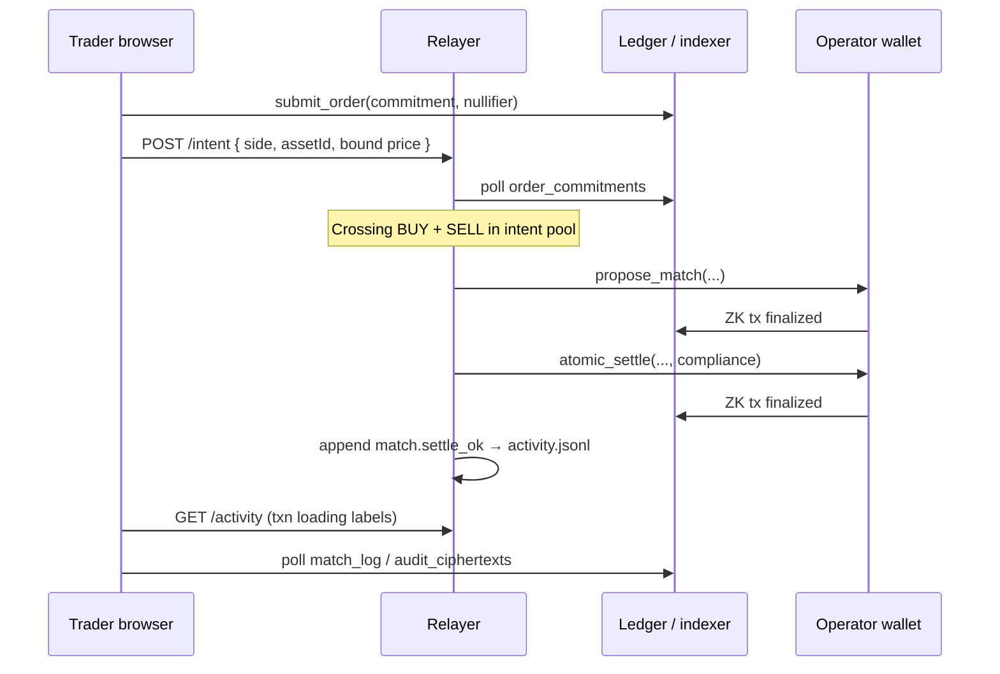

# Obsidian

Obsidian is an over-the-counter dark pool that uses zero-knowledge proofs to hide order details. When a user submits an order, it shows up on the block explorer as a blind 32-byte hash instead of cleartext. An off-chain matchmaker couples buyers and sellers privately. Then, our smart contract cryptographically verifies that the assets match and the prices overlap without revealing the actual numbers. After a match, the contract deletes the active order slots from the ledger and inserts an encrypted compliance payload for audit purposes.


| Directory                | Purpose                                                                      |
| ------------------------ | ---------------------------------------------------------------------------- |
| `[frontend/](frontend/)` | React + Vite trader UI (Lace wallet, order ticket, activity-driven txn flow) |
| `[core/](core/)`         | Compact contract, Vitest harness, Docker devnet, matching relayer, CLI tools |
| `[backend/](backend/)`   | Relayer architecture and multi-browser dev guide                             |


## How it works

Traders publish only **32-byte commitments** and **nullifiers** on-chain (`submit_order`). Asset, side, and price bounds stay off-chain in the relayer intent pool until a matchmaker runs `propose_match` → `atomic_settle`.

Contract: `[core/contracts/obsidian.compact](core/contracts/obsidian.compact)`

### end to end flow




## Prerequisites

- Node.js 22+, Yarn 1.x (core), npm (frontend)
- Docker (local devnet + proof server)
- Lace wallet (Midnight-capable) for the UI

## Quick start

```bash
# 1. Install
cd core && yarn install
cd ../frontend && npm install

# 2. Devnet
yarn env:up

# 3. Deploy contract
yarn deploy:contracts
cp .env.example .env
# set OBSIDIAN_CONTRACT_ADDRESS=<hex printed above>

# 4. UI (terminal 3)
yarn frontend:dev
# → http://localhost:5173 — Connect Lace (undeployed preset)

```

## Environment


| Variable                     | Description                       |
| ---------------------------- | --------------------------------- |
| `OBSIDIAN_CONTRACT_ADDRESS`  | Deployed contract hex (required)  |
| `RELAYER_SEED`               | Operator wallet seed (relayer)    |
| `OBSIDIAN_RELAYER_HTTP_PORT` | Relayer API port (default `3033`) |


See `[.env.example](.env.example)`. Do not commit `.env`.

## Scripts


| Script                          | Action                            |
| ------------------------------- | --------------------------------- |
| `yarn env:up` / `yarn env:down` | Docker devnet                     |
| `yarn frontend:dev`             | Vite UI on :5173                  |
| `yarn deploy:contracts`         | Deploy + full circuit walkthrough |
| `yarn submit:pair`              | CLI BUY + SELL + match/settle     |
| `yarn relayer`                  | Matching relayer + HTTP API       |
| `yarn test:local`               | Vitest on local devnet            |


## References

- [Midnight local network](https://docs.midnight.network/guides/midnight-local-network)
- [Midnight Hello World](https://docs.midnight.network/getting-started/hello-world)

